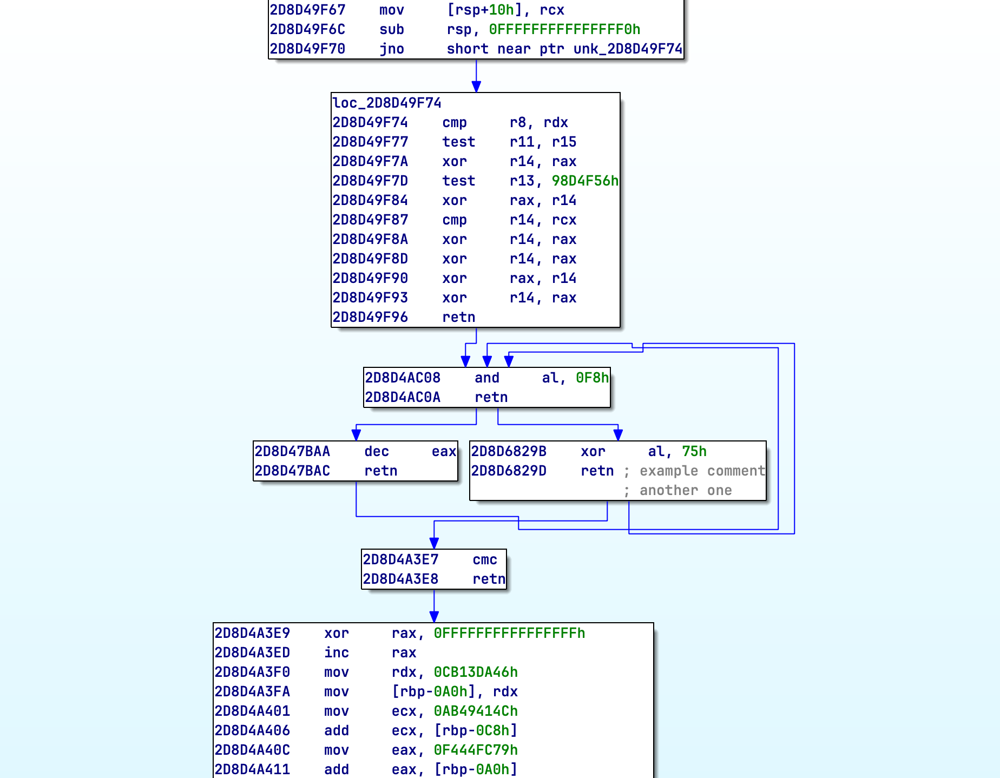

# GraphViewer

A programmatic framework for visualizing instruction execution traces as interactive Control Flow Graphs (CFG) within IDA Pro.



## Overview

Analyzing heavily obfuscated "spaghetti code" can be an overwhelming task. When static analysis fails to define functions or resolve complex control flow, traditional linear disassembly becomes difficult to follow.

This tool solves that problem by converting execution traces recorded from debuggers or emulators into interactive graphs. By visualizing the **actual execution path**, it automatically detects basic block boundaries and leverages IDA's native UI to help you identify patterns, loops, and logic structures that are otherwise hard to follow in linear disassembly.

## Key Features

- Automatically reconstructs a graph from a linear list of executed addresses.
- Detects basic block boundaries at branch targets and where execution paths converge.
- Automatically identifies and colors function prologues and epilogues.
- Distinctly colors the final executed block for easy orientation.
- Supports multi-line comments per instruction, allowing you to embed trace metadata (like register values) directly into the graph.
- Built on an extensible `Proc` base class, making it easy to support custom architectures.
- Persist and reload graphs to disk for later analysis.

## Usage

```python
proc = Proc_x86_64()
trace_graph = Graph("Graph Name", proc)

trace = [
    0x140001000, # push rbp
    0x140001001, # mov rbp, rsp
    0x140001004, # sub rsp, 20h
    0x140001008, # call rax
    0x14000100D, # add rsp, 20h
    0x140001011, # pop rbp
    0x140001012  # retn
]

for ea in trace:
    trace_graph.process(ea)

trace_graph.add_insn_cmt(0x140001008, "Indirect call target")
trace_graph.add_insn_cmt(0x140001008, "Observed RAX: 0x7FF01234")

trace_graph.save(file_path)
trace_graph.Show()
```

#### Loading Trace From File
```python
proc = Proc_x86_64()
trace_graph = Graph("My Trace", proc).load(file_path)
trace_graph.Show()
```

## Important Notes

-  This tool visualizes the *recorded path*. It does not discover branches that were not taken during the trace.
- For the clearest results, it is recommended to filter out instructions past `call` (except when the call is in fact obfuscated `jmp`) and keep processing again after return.
